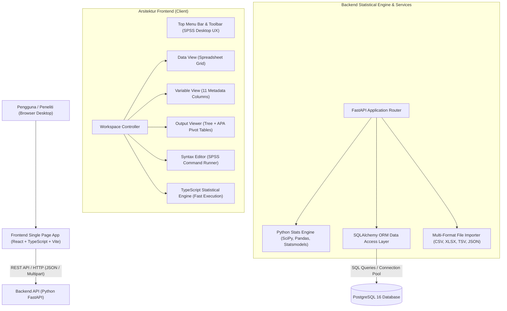
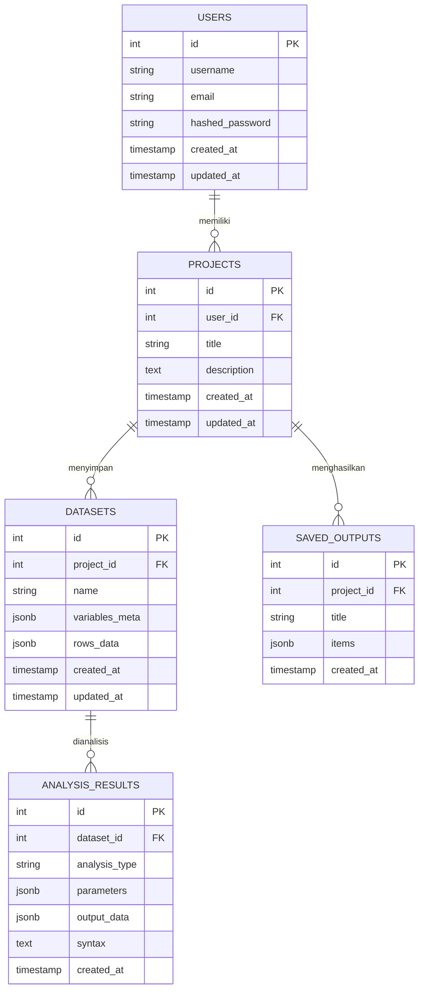

# 2. Arsitektur Sistem & ERD Database

## 2.1 Arsitektur Tingkat Tinggi (High-Level Architecture)

Aplikasi dibangun dengan pola **Clean Decoupled Architecture** yang memisahkan lapisan presentasi antarmuka, engine komputasi statistik, dan persistensi database:

---

## 2.2 Entity Relationship Diagram (ERD) Database

Sistem database dirancang secara relasional menggunakan PostgreSQL untuk menyimpan data pengguna, proyek riset, riwayat dataset, parameter analisis, dan dokumen keluaran yang disimpan.

---

## 2.3 Rincian Struktur Kolom Tabel PostgreSQL

### 1. Tabel `users`
| Kolom | Tipe Data | Keterangan |
|---|---|---|
| `id` | `INTEGER PRIMARY KEY GENERATED ALWAYS AS IDENTITY` | ID unik pengguna |
| `username` | `VARCHAR(50) UNIQUE NOT NULL` | Username login |
| `email` | `VARCHAR(100) UNIQUE NOT NULL` | Alamat surel |
| `hashed_password` | `VARCHAR(255) NOT NULL` | Password terenkripsi bcrypt |
| `created_at` | `TIMESTAMP WITH TIME ZONE DEFAULT NOW()` | Waktu registrasi |
| `updated_at` | `TIMESTAMP WITH TIME ZONE DEFAULT NOW()` | Waktu pembaruan profil |

### 2. Tabel `projects`
| Kolom | Tipe Data | Keterangan |
|---|---|---|
| `id` | `INTEGER PRIMARY KEY GENERATED ALWAYS AS IDENTITY` | ID unik proyek riset |
| `user_id` | `INTEGER REFERENCES users(id) ON DELETE CASCADE` | ID pemilik proyek |
| `title` | `VARCHAR(150) NOT NULL` | Judul proyek (contoh: "Survei Kepuasan Karyawan 2026.sav") |
| `description` | `TEXT` | Deskripsi atau catatan metodologi penelitian |
| `created_at` | `TIMESTAMP WITH TIME ZONE DEFAULT NOW()` | Waktu pembuatan |
| `updated_at` | `TIMESTAMP WITH TIME ZONE DEFAULT NOW()` | Waktu modifikasi terakhir |

### 3. Tabel `datasets`
| Kolom | Tipe Data | Keterangan |
|---|---|---|
| `id` | `INTEGER PRIMARY KEY GENERATED ALWAYS AS IDENTITY` | ID dataset |
| `project_id` | `INTEGER REFERENCES projects(id) ON DELETE CASCADE` | ID proyek terkait |
| `name` | `VARCHAR(150) NOT NULL` | Nama dataset aktif (misal: "DataSet1") |
| `variables_meta` | `JSONB NOT NULL` | Array 11 metadata SPSS (`name`, `type`, `width`, `decimals`, `label`, `values`, `missing`, `columns`, `align`, `measure`, `role`) |
| `rows_data` | `JSONB NOT NULL` | Array objek record data tiap baris responden |
| `created_at` | `TIMESTAMP WITH TIME ZONE DEFAULT NOW()` | Waktu pembuatan |
| `updated_at` | `TIMESTAMP WITH TIME ZONE DEFAULT NOW()` | Waktu modifikasi data |

### 4. Tabel `analysis_results`
| Kolom | Tipe Data | Keterangan |
|---|---|---|
| `id` | `INTEGER PRIMARY KEY GENERATED ALWAYS AS IDENTITY` | ID hasil analisis |
| `dataset_id` | `INTEGER REFERENCES datasets(id) ON DELETE CASCADE` | ID dataset rujukan |
| `analysis_type` | `VARCHAR(50) NOT NULL` | Jenis uji (`frequencies`, `descriptives`, `anova`, `regression`, dll.) |
| `parameters` | `JSONB` | Parameter input (variabel terpilih, tingkat kepercayaan, dll.) |
| `output_data` | `JSONB NOT NULL` | Hasil numerik komputasi statistik (tabel pivot dan ringkasan) |
| `syntax` | `TEXT` | Perintah sintaks SPSS yang dieksekusi |
| `created_at` | `TIMESTAMP WITH TIME ZONE DEFAULT NOW()` | Waktu eksekusi |

### 5. Tabel `saved_outputs`
| Kolom | Tipe Data | Keterangan |
|---|---|---|
| `id` | `INTEGER PRIMARY KEY GENERATED ALWAYS AS IDENTITY` | ID dokumen keluaran |
| `project_id` | `INTEGER REFERENCES projects(id) ON DELETE CASCADE` | ID proyek rujukan |
| `title` | `VARCHAR(150) NOT NULL` | Judul dokumen output (misal: "Laporan Uji Hipotesis.spv") |
| `items` | `JSONB NOT NULL` | Seluruh pohon simpul output berisi tabel pivot, log, dan grafik |
| `created_at` | `TIMESTAMP WITH TIME ZONE DEFAULT NOW()` | Waktu penyimpanan |

---

## 2.4 Alur Data (Data Flow Pipeline)

1. **Tahap Akuisisi Data**:
   Pengguna mengunggah berkas Excel (`.xlsx`), CSV, atau memilih sample data bawaan. Parser backend/frontend mengekstrak header kolom, mendeteksi tipe data (Numerik vs String), mengidentifikasi skala pengukuran (Skala, Ordinal, Nominal), dan mengisi tabel Data View & Variable View.
2. **Tahap Manajemen Variabel & Nilai**:
   Pengguna dapat menetapkan nama, desimal, label variabel, serta mendefinisikan label nilai (*Value Labels*, misal: `1 = Laki-laki, 2 = Perempuan`) melalui dialog interaktif SPSS.
3. **Tahap Spesifikasi Analisis**:
   Pengguna memilih menu `Analyze` $\rightarrow$ memilih modul statistik. Dialog 2-kotak SPSS terbuka. Pengguna memindahkan variabel kandidat ke kotak target dengan tombol panah `>`.
4. **Tahap Eksekusi**:
   - Jika pengguna menekan **[OK]**: Komputasi statistik dijalankan secara instan dan hasilnya ditambahkan ke simpul dokumen di **Output Viewer**.
   - Jika pengguna menekan **[Paste]**: Kode perintah sintaks standar SPSS otomatis dihasilkan dan ditempelkan ke panel **Syntax Editor**.
5. **Tahap Pelaporan & Ekspor**:
   Seluruh tabel pivot dan grafik di Output Viewer dapat langsung diekspor ke berkas PDF berstandar publikasi akademik, diekspor ke Excel multi-sheet, atau dicetak.
