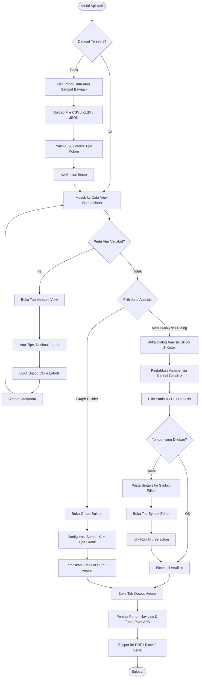
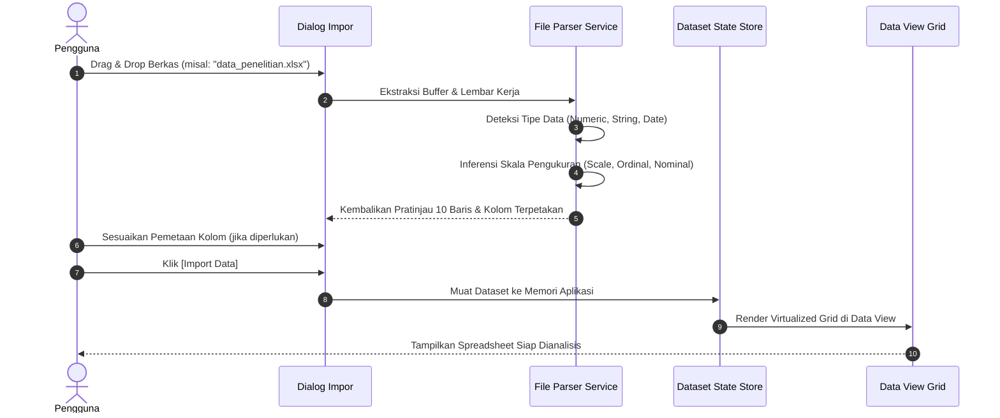
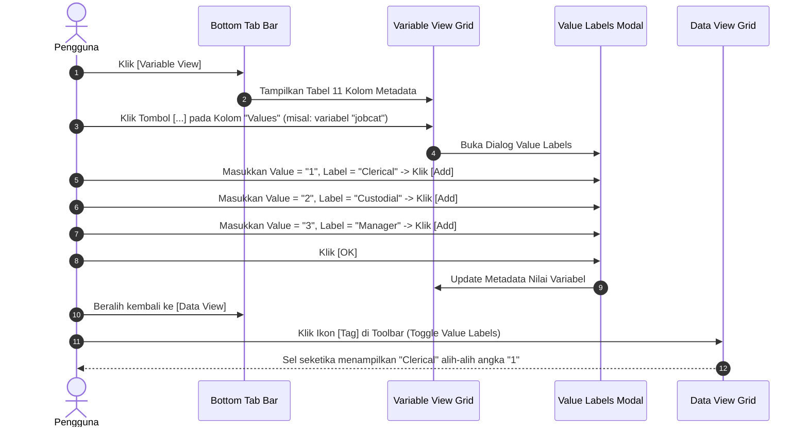
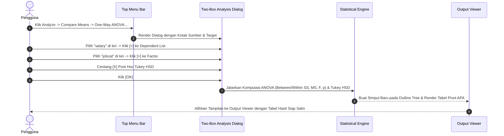
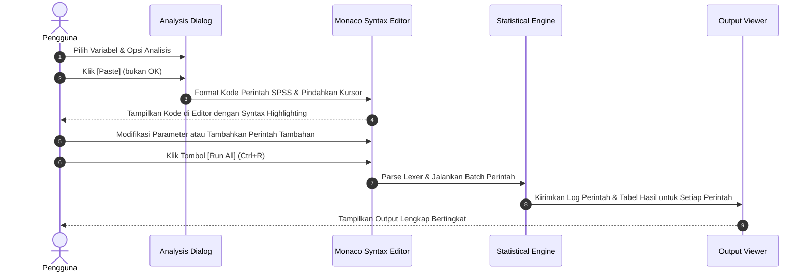

# PHASE 3: User Flow & Journey Maps
**Project**: StatisticaPro Enterprise  
**Document Ref**: FLOW-STAT-2026-V2  
**Author**: Senior UI/UX Designer & Senior Product Manager  
**Status**: APPROVED  

---

## 1. Alur Perjalanan Pengguna Utama (Master Journey Map)

Pengguna platform beroperasi dalam siklus ilmiah: **Akuisisi Data** $\rightarrow$ **Manajemen Variabel** $\rightarrow$ **Eksplorasi / Uji Hipotesis** $\rightarrow$ **Interpretasi Output** $\rightarrow$ **Pelaporan**.

---

## 2. Alur Rinci Masing-Masing Modul

### 2.1 Alur 1: Impor Data & Pemetaan Otomatis

### 2.2 Alur 2: Konfigurasi Variabel & Label Nilai (Value Labels)

### 2.3 Alur 3: Eksekusi Analisis Statistik (Analyze Menu $\rightarrow$ Output Viewer)

### 2.4 Alur 4: Alur Kerja Sintaks (Syntax Workflow)

