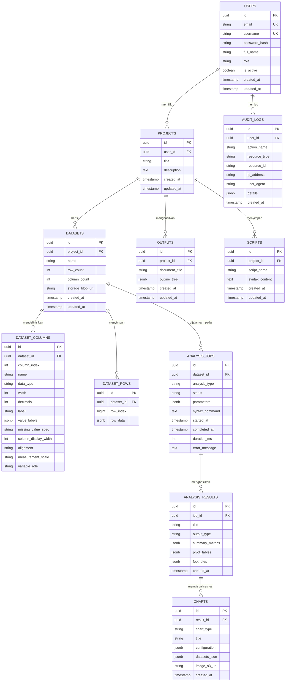

# PHASE 5: Database Design & Schema DDL
**Project**: StatisticaPro Enterprise  
**Document Ref**: DB-STAT-2026-V2  
**Author**: Principal Software Architect & Senior Backend Engineer  
**Database**: PostgreSQL 16 Enterprise  
**Status**: APPROVED  

---

## 1. Entity Relationship Diagram (ERD) Lengkap

Skema relasional 11 tabel enterprise yang saling terhubung:



---

## 2. Naskah SQL DDL Produksi (PostgreSQL 16)

```sql
-- Ekstensi UUID dan B-Tree
CREATE EXTENSION IF NOT EXISTS "uuid-ossp";
CREATE EXTENSION IF NOT EXISTS "pgcrypto";

-- 1. Tabel users
CREATE TABLE users (
    id UUID PRIMARY KEY DEFAULT gen_random_uuid(),
    email VARCHAR(255) UNIQUE NOT NULL,
    username VARCHAR(100) UNIQUE NOT NULL,
    password_hash VARCHAR(255) NOT NULL,
    full_name VARCHAR(150),
    role VARCHAR(50) DEFAULT 'researcher' CHECK (role IN ('admin', 'researcher', 'analyst', 'viewer')),
    is_active BOOLEAN DEFAULT TRUE,
    created_at TIMESTAMP WITH TIME ZONE DEFAULT CURRENT_TIMESTAMP,
    updated_at TIMESTAMP WITH TIME ZONE DEFAULT CURRENT_TIMESTAMP
);

CREATE INDEX idx_users_email ON users(email);
CREATE INDEX idx_users_username ON users(username);

-- 2. Tabel projects
CREATE TABLE projects (
    id UUID PRIMARY KEY DEFAULT gen_random_uuid(),
    user_id UUID NOT NULL REFERENCES users(id) ON DELETE CASCADE,
    title VARCHAR(200) NOT NULL DEFAULT 'Untitled Dataset.sav',
    description TEXT,
    created_at TIMESTAMP WITH TIME ZONE DEFAULT CURRENT_TIMESTAMP,
    updated_at TIMESTAMP WITH TIME ZONE DEFAULT CURRENT_TIMESTAMP
);

CREATE INDEX idx_projects_user ON projects(user_id);

-- 3. Tabel datasets
CREATE TABLE datasets (
    id UUID PRIMARY KEY DEFAULT gen_random_uuid(),
    project_id UUID NOT NULL REFERENCES projects(id) ON DELETE CASCADE,
    name VARCHAR(200) NOT NULL DEFAULT 'DataSet1',
    row_count INTEGER DEFAULT 0,
    column_count INTEGER DEFAULT 0,
    storage_blob_uri VARCHAR(500),
    created_at TIMESTAMP WITH TIME ZONE DEFAULT CURRENT_TIMESTAMP,
    updated_at TIMESTAMP WITH TIME ZONE DEFAULT CURRENT_TIMESTAMP
);

CREATE INDEX idx_datasets_project ON datasets(project_id);

-- 4. Tabel dataset_columns (11 Metadata SPSS)
CREATE TABLE dataset_columns (
    id UUID PRIMARY KEY DEFAULT gen_random_uuid(),
    dataset_id UUID NOT NULL REFERENCES datasets(id) ON DELETE CASCADE,
    column_index INTEGER NOT NULL,
    name VARCHAR(100) NOT NULL,
    data_type VARCHAR(50) DEFAULT 'Numeric' CHECK (data_type IN ('Numeric', 'String', 'Date', 'Currency', 'Percentage')),
    width INTEGER DEFAULT 8,
    decimals INTEGER DEFAULT 2,
    label VARCHAR(255) DEFAULT '',
    value_labels JSONB DEFAULT '{}'::jsonb,
    missing_value_spec VARCHAR(100) DEFAULT 'None',
    column_display_width INTEGER DEFAULT 8,
    alignment VARCHAR(20) DEFAULT 'Right' CHECK (alignment IN ('Left', 'Right', 'Center')),
    measurement_scale VARCHAR(30) DEFAULT 'Scale' CHECK (measurement_scale IN ('Scale', 'Ordinal', 'Nominal')),
    variable_role VARCHAR(30) DEFAULT 'Input' CHECK (variable_role IN ('Input', 'Target', 'Both', 'None', 'Partition', 'Split')),
    CONSTRAINT uq_dataset_col_name UNIQUE (dataset_id, name)
);

CREATE INDEX idx_dataset_columns_lookup ON dataset_columns(dataset_id, column_index);

-- 5. Tabel dataset_rows (Chunked storage untuk performa 100k+ baris)
CREATE TABLE dataset_rows (
    id UUID PRIMARY KEY DEFAULT gen_random_uuid(),
    dataset_id UUID NOT NULL REFERENCES datasets(id) ON DELETE CASCADE,
    row_index BIGINT NOT NULL,
    row_data JSONB NOT NULL,
    CONSTRAINT uq_dataset_row_idx UNIQUE (dataset_id, row_index)
);

CREATE INDEX idx_dataset_rows_paging ON dataset_rows(dataset_id, row_index);

-- 6. Tabel analysis_jobs (Manajemen status async/sync eksekusi)
CREATE TABLE analysis_jobs (
    id UUID PRIMARY KEY DEFAULT gen_random_uuid(),
    dataset_id UUID NOT NULL REFERENCES datasets(id) ON DELETE CASCADE,
    analysis_type VARCHAR(100) NOT NULL,
    status VARCHAR(50) DEFAULT 'PENDING' CHECK (status IN ('PENDING', 'RUNNING', 'COMPLETED', 'FAILED')),
    parameters JSONB NOT NULL DEFAULT '{}'::jsonb,
    syntax_command TEXT,
    started_at TIMESTAMP WITH TIME ZONE DEFAULT CURRENT_TIMESTAMP,
    completed_at TIMESTAMP WITH TIME ZONE,
    duration_ms INTEGER,
    error_message TEXT
);

CREATE INDEX idx_analysis_jobs_status ON analysis_jobs(dataset_id, status);

-- 7. Tabel analysis_results
CREATE TABLE analysis_results (
    id UUID PRIMARY KEY DEFAULT gen_random_uuid(),
    job_id UUID NOT NULL REFERENCES analysis_jobs(id) ON DELETE CASCADE,
    title VARCHAR(200) NOT NULL,
    output_type VARCHAR(100) NOT NULL,
    summary_metrics JSONB DEFAULT '{}'::jsonb,
    pivot_tables JSONB NOT NULL,
    footnotes JSONB DEFAULT '[]'::jsonb,
    created_at TIMESTAMP WITH TIME ZONE DEFAULT CURRENT_TIMESTAMP
);

CREATE INDEX idx_analysis_results_job ON analysis_results(job_id);

-- 8. Tabel charts (Konfigurasi visualisasi & metadata gambar)
CREATE TABLE charts (
    id UUID PRIMARY KEY DEFAULT gen_random_uuid(),
    result_id UUID REFERENCES analysis_results(id) ON DELETE CASCADE,
    chart_type VARCHAR(50) NOT NULL CHECK (chart_type IN ('bar', 'pie', 'histogram', 'scatter', 'line', 'area', 'boxplot')),
    title VARCHAR(200) NOT NULL,
    configuration JSONB NOT NULL,
    datasets_json JSONB NOT NULL,
    image_s3_uri VARCHAR(500),
    created_at TIMESTAMP WITH TIME ZONE DEFAULT CURRENT_TIMESTAMP
);

-- 9. Tabel outputs (Hierarchical Outline Documents)
CREATE TABLE outputs (
    id UUID PRIMARY KEY DEFAULT gen_random_uuid(),
    project_id UUID NOT NULL REFERENCES projects(id) ON DELETE CASCADE,
    document_title VARCHAR(200) DEFAULT 'Output Document',
    outline_tree JSONB NOT NULL,
    created_at TIMESTAMP WITH TIME ZONE DEFAULT CURRENT_TIMESTAMP,
    updated_at TIMESTAMP WITH TIME ZONE DEFAULT CURRENT_TIMESTAMP
);

CREATE INDEX idx_outputs_project ON outputs(project_id);

-- 10. Tabel scripts (Syntax Scripts)
CREATE TABLE scripts (
    id UUID PRIMARY KEY DEFAULT gen_random_uuid(),
    project_id UUID NOT NULL REFERENCES projects(id) ON DELETE CASCADE,
    script_name VARCHAR(200) DEFAULT 'Syntax1.sps',
    syntax_content TEXT NOT NULL,
    created_at TIMESTAMP WITH TIME ZONE DEFAULT CURRENT_TIMESTAMP,
    updated_at TIMESTAMP WITH TIME ZONE DEFAULT CURRENT_TIMESTAMP
);

-- 11. Tabel audit_logs (Kepatuhan & Audit Trail)
CREATE TABLE audit_logs (
    id UUID PRIMARY KEY DEFAULT gen_random_uuid(),
    user_id UUID REFERENCES users(id) ON DELETE SET NULL,
    action_name VARCHAR(100) NOT NULL,
    resource_type VARCHAR(100) NOT NULL,
    resource_id VARCHAR(100),
    ip_address VARCHAR(45),
    user_agent TEXT,
    details JSONB DEFAULT '{}'::jsonb,
    created_at TIMESTAMP WITH TIME ZONE DEFAULT CURRENT_TIMESTAMP
);

CREATE INDEX idx_audit_logs_user ON audit_logs(user_id, created_at DESC);
```
