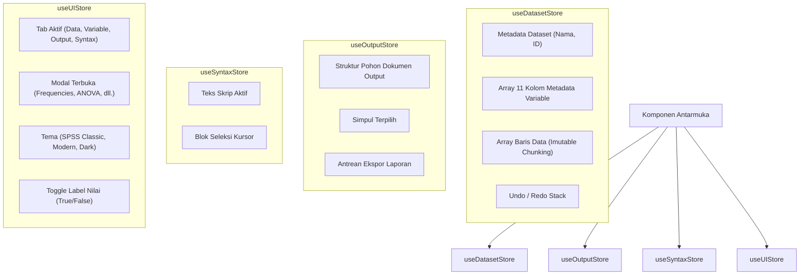

# PHASE 7: Frontend Architecture
**Project**: StatisticaPro Enterprise  
**Framework**: React 18 + TypeScript + Vite  
**State**: Zustand + TanStack Query  
**Grid Engine**: TanStack Table + TanStack Virtual  
**Editor**: Monaco Editor (VS Code Engine)  
**Status**: APPROVED  

---

## 1. Struktur Folder Modular Enterprise (`src/`)

```
frontend/src/
├── assets/                  # Brand SVG icons, SPSS measurement symbols
├── components/              # Reusable UI Primitives & Radix UI Wrappers
│   ├── ui/
│   │   ├── Button.tsx
│   │   ├── Dialog.tsx       # Radix Dialog wrapper
│   │   ├── DropdownMenu.tsx # Radix Dropdown wrapper
│   │   ├── Tabs.tsx         # Radix Tabs wrapper
│   │   ├── Tooltip.tsx      # Radix Tooltip wrapper
│   │   └── Select.tsx       # Radix Select wrapper
│   ├── TopMenuBar.tsx       # 11 Menu Desktop SPSS
│   ├── Toolbar.tsx          # Toolbar Ribbon Aksi Desktop
│   ├── FormulaBar.tsx       # Coordinate & Active Cell Value
│   └── BottomStatusBar.tsx  # Status Processor & Filter/Weight indicators
│
├── features/                # Domain-Driven Feature Modules
│   ├── data-view/           # High-Performance Virtualized Spreadsheet
│   │   ├── DataViewGrid.tsx
│   │   ├── VirtualCell.tsx
│   │   └── hooks/useGridVirtualizer.ts
│   ├── variable-view/       # 11 Kolom Metadata SPSS
│   │   ├── VariableViewGrid.tsx
│   │   └── ValueLabelsModal.tsx
│   ├── output-viewer/       # Tree Outline & APA Pivot Tables
│   │   ├── OutputViewer.tsx
│   │   ├── TreeOutline.tsx
│   │   └── PivotTableRenderer.tsx
│   ├── syntax-editor/       # Monaco Editor Integration
│   │   ├── SyntaxEditor.tsx
│   │   └── spssLanguageDefinition.ts # SPSS Grammar & Autocomplete
│   ├── analysis-dialogs/    # Two-Box Selector Dialogs
│   │   ├── AnalysisDialogManager.tsx
│   │   ├── VariablePicker.tsx
│   │   └── dialogs/         # Dialog Spesifik: ANOVA, TTest, Regresi, dll.
│   └── graph-builder/       # Drag-and-Drop Chart Builder
│       ├── GraphBuilderModal.tsx
│       └── ChartCanvas.tsx
│
├── stores/                  # Zustand Global State Slices
│   ├── useDatasetStore.ts   # Data rows, columns meta, history, value labels
│   ├── useOutputStore.ts    # Tree items, active selection, persistence
│   ├── useSyntaxStore.ts    # Script text, run history, templates
│   └── useUIStore.ts        # Active view, active modal, theme toggle
│
├── services/                # API & Network Services
│   ├── apiClient.ts         # Axios/Fetch client dengan interceptor JWT
│   ├── statsService.ts      # Endpoint remote call ke FastAPI
│   └── exportService.ts     # PDF, Excel, CSV exporter
│
├── hooks/                   # Custom Utility Hooks
│   ├── useKeyboardShortcuts.ts
│   └── useStatisticalDualEngine.ts
│
├── utils/                   # Murni Komputasi & Formatting
│   ├── clientStats.ts       # TypeScript Zero-Latency Statistical Engine
│   └── formatters.ts        # Number, currency, and date formatters
│
└── types/                   # TypeScript Interfaces & Contract Types
    ├── spss.ts
    └── api.ts
```

---

## 2. Desain Manajemen Status (*Zustand State Architecture*)

Status aplikasi dibagi menjadi store terpisah untuk mencegah re-render berlebihan:



---

## 3. Pipeline Virtualisasi Spreadsheet (TanStack Virtual)

Untuk menjamin performa rendering pada dataset berukuran 100.000 baris x 500 kolom:
1. **Windowing 2D**: Menggunakan `useVirtualizer` secara simultan pada sumbu vertikal (baris) dan horizontal (kolom).
2. **Penggunaan Memori Rendah**: Hanya ~30 elemen baris DOM yang benar-benar ada di browser secara bersamaan, bertransformasi posisi via `transform: translateY(...)`.
3. **Pemisahan Input State**: Saat sel diedit, hanya sel lokal yang memegang state input aktif (*uncontrolled input dengan onBlur commit*) sehingga pengetikan berlangsung dengan latensi < 5ms tanpa me-render ulang seluruh tabel.
